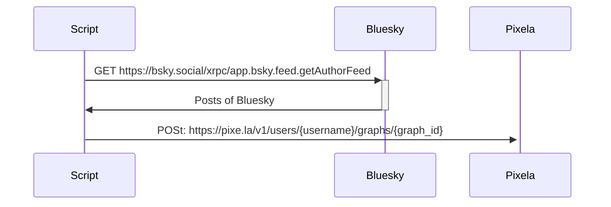

毎日の [Bluesky](https://bsky.app) への投稿を [Pixela](https://pixe.la) の草に変換するツールを作りました。[ソースコードは GitHub に置いてあります](https://github.com/mahata/bsky-pixela-tracker)。僕の場合はこういう感じになります。

自分はヒマなときだけ Bluesky へ投稿している自覚があります。それを可視化する目的で作りました。

## 実装

次のように、Bluesky API を叩き、日毎の投稿数を集計した上で Pixela へ POST する作りになっています。

詳しい実装はソースコードに譲りますが、Bluesky も Pixela も API 仕様が素直で作りやすいと思いました。

## おまけ

リポジトリには定期的にスクリプトを実行する GitHub Actions のワークフローを含めてあります。

https://github.com/mahata/bsky-pixela-tracker/blob/8f7951f20c5376ee2f8af39e32b5126a44294344/.github/workflows/daily-batch.yml#L1-L30

ご興味があれば、コードをクローンして Bluesky と Pixela の環境変数を設定をし、定期的に草を更新できます。
